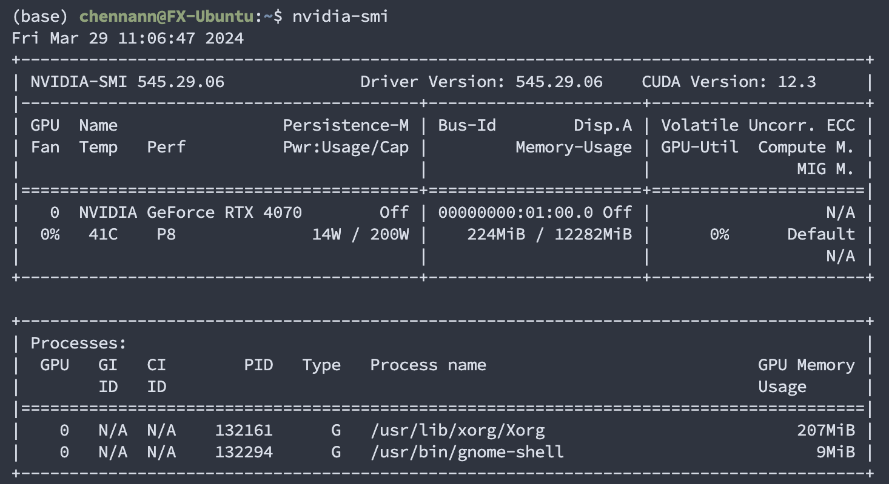
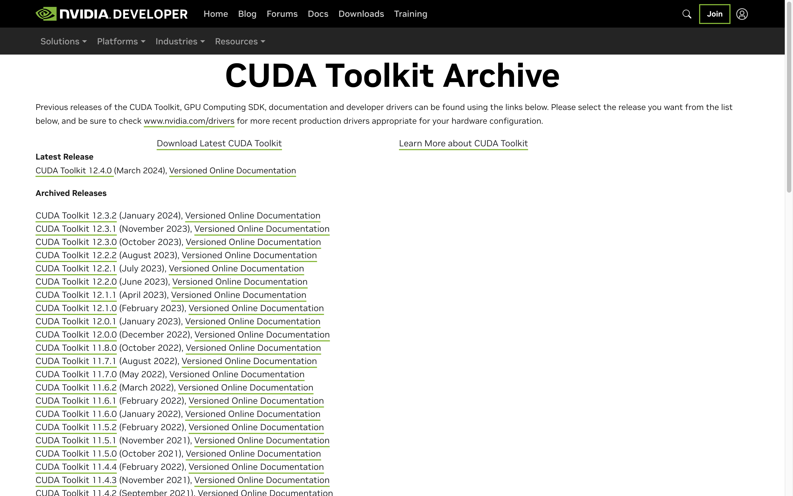
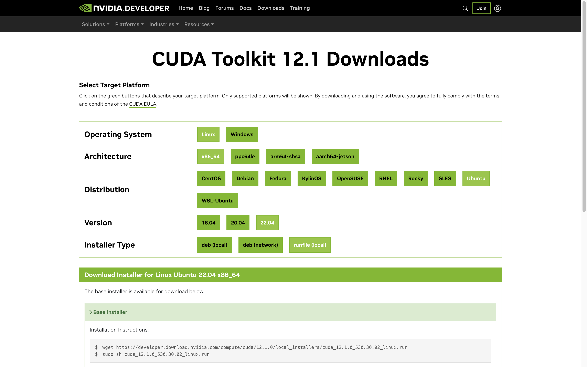
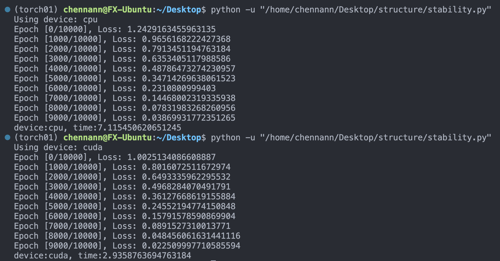
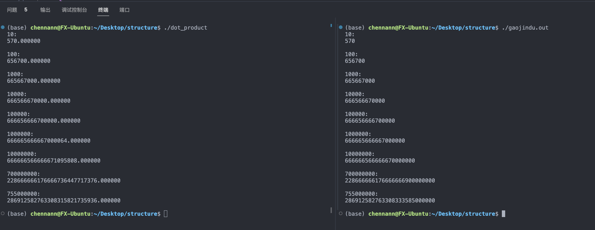

```json
{
  "date": "2024.07.08 23:14",
  "tags": ["cuda", "Linux"]
}
```

# CUDA及pytorch环境配置


## 安装cuda

- 选择cuda版本，注意和显卡驱动的版本匹配。检查到显卡驱动的cuda版本是`12.3`，所以这里CUDA Toolkit版本可以选择`12.1.0`






- 选择对应系统环境，运行提示的指令。下载runfile然后运行它。




## 安装pytorch

- 进入pytorch官网，选择对应信息，复制指令，运行
- 


## 测试pytorch和cuda是否安装成功

*一份代码用于验证多个实验目的*

### 实验目的

1. 测试cuda和pytorch是否安装成功
2. 测试同一套代码cpu和gpu在执行效率上的差异
3. 测试pytorch框架中张量维度出错的情况


### 实验过程

#### 【目的1】

```python
import torch
import torch.nn as nn
import torch.optim as optim
			...
device = torch.device('cuda' if torch.cuda.is_available() else 'cpu')
print(f"Using device: {device}")
			...
```

运行过程中没有报错，并且输出`Using device: cuda`，代表pytorch和cuda安装成功。


#### 【目的2】

```python
			...
device = torch.device('cuda' if torch.cuda.is_available() else 'cpu')
# device = torch.device('cpu')
  		...

n_epoches = 10000
start_time = time.time()


for epoch in range(n_epoches):  

    outputs = model(inputs)
    loss = criterion(outputs, targets)

    optimizer.zero_grad()
    loss.backward()
    optimizer.step()

    if epoch % 1000 == 0:
        print(f"Epoch [{epoch}/{n_epoches}], Loss: {loss.item()}")

end_time = time.time();
print(f"device:{device}, time:{(end_time-start_time)}");
```

分别在cpu和gpu上运行简单MLP，在相同运算量下，cpu比gpu多出1倍运算时间。




#### 【目的3】

```python
class SimpleMLP(nn.Module):
    def __init__(self):
        super(SimpleMLP, self).__init__()
        self.layers = nn.Sequential(
            nn.Linear(10, 50),
            nn.ReLU(),
            nn.Linear(50, 2)
        )

    def forward(self, x):
        return self.layers(x)

			...
      
inputs = torch.randn(320, 10).to(device)
targets = torch.randn(320, 1).to(device)

			...
  
```

inputs输入模型之后最终得到的是$320 \times 2$的输出矩阵，然而初始化的target维度是$320 \times 1$，两个向量维度不匹配，这会在计算loss的部分产生一些问题，pytoch在运行过程中指出了我的错误。

但是pytorch在指出错误之后并没有停止运行，事实上在输出上看不出明显的差异，结果也收敛了。这是因为MSEloss在接收到两个维度不同的张量时，内部进行了广播操作，维度较小的张量被扩大到了和另一个张量相同的维度。但是需要注意广播机制只适用于被扩展的张量维度是$1$的情况，如果`targets = torch.randn(220, 2).to(device)`程序会报错，并且停止运行。

考虑为什么广播后运行结果还是会收敛，可能是`inputs`和`targets`本身是随机出来的，没有什么实际意义。


### 完整代码

```python
import torch
import torch.nn as nn
import torch.optim as optim
import numpy as np
import time

class SimpleMLP(nn.Module):
    def __init__(self):
        super(SimpleMLP, self).__init__()
        self.layers = nn.Sequential(
            nn.Linear(10, 50),
            nn.ReLU(),
            nn.Linear(50, 2)
        )

    def forward(self, x):
        return self.layers(x)


device = torch.device('cuda' if torch.cuda.is_available() else 'cpu')
# device = torch.device('cpu')

print(f"Using device: {device}")

model = SimpleMLP().to(device)
criterion = nn.MSELoss()
optimizer = optim.Adam(model.parameters(), lr=0.0001)


n_epoches = 10000


inputs = torch.randn(320, 10).to(device)
targets = torch.randn(320, 1).to(device)


start_time = time.time()


for epoch in range(n_epoches):  

    outputs = model(inputs)
    loss = criterion(outputs, targets)

    optimizer.zero_grad()
    loss.backward()
    optimizer.step()

    if epoch % 1000 == 0:
        print(f"Epoch [{epoch}/{n_epoches}], Loss: {loss.item()}")

end_time = time.time();
print(f"device:{device}, time:{(end_time-start_time)}");

```


## 点积并行运算-cuda编程——.cu实现

### 【代码】

```c++
#include <stdio.h>

__global__ void dot_product(double *a, double *b, double *c, long long n)
{
    __shared__ double cache[256];
    int tid = threadIdx.x + blockIdx.x * blockDim.x;
    int cacheIndex = threadIdx.x;
    double temp = 0;
    while (tid < n) {
        temp += a[tid] * b[tid];
        tid += blockDim.x * gridDim.x;
    }

    cache[cacheIndex] = temp;

    __syncthreads();

    int i = blockDim.x / 2;
    while (i != 0) {
        if (cacheIndex < i) {
            cache[cacheIndex] += cache[cacheIndex + i];
        }
        __syncthreads();
        i /= 2;
    }

    // 将块内的结果累加到全局内存的c[0]中
    if (cacheIndex == 0)
    {
        atomicAdd(c, cache[0]);
    }
}

int main()
{
    long long n_arr[] = {10, 100, 1000, 10000, 100000, 1000000, 10000000, 700000000, 755000000};
    // long long n_arr[] = {10};

    for (auto n : n_arr) {
        double *a, *b, *c;
        double *d_a, *d_b, *d_c; // 设备上的数组
        long long size = n * sizeof(double);

        cudaMalloc((void **)&d_a, size);
        cudaMalloc((void **)&d_b, size);
        cudaMalloc((void **)&d_c, sizeof(double));

        a = (double *)malloc(size);
        b = (double *)malloc(size);
        c = (double *)malloc(sizeof(double));

        for (int i = 0; i < n; i++)
        {
            a[i] = i;
            b[i] = i * 2;
        }

        *c = 0;

        cudaMemcpy(d_a, a, size, cudaMemcpyHostToDevice);
        cudaMemcpy(d_b, b, size, cudaMemcpyHostToDevice);
        cudaMemcpy(d_c, c, sizeof(double), cudaMemcpyHostToDevice);


        dot_product<<<256, 256>>>(d_a, d_b, d_c, n);

        cudaDeviceSynchronize();

        cudaMemcpy(c, d_c, sizeof(double), cudaMemcpyDeviceToHost);

        printf("%lld:\n%f\n",n, *c);

        // long double correctRes = (long double)(n-1) * (long double)n * (long double)(2*n-1) / 3.0;
        
        // printf("%Lf\n", correctRes);
        // if (fabs(correctRes - *c) < 1e7) printf("correct");

        free(a);
        free(b);
        free(c);
        cudaFree(d_a);
        cudaFree(d_b);
        cudaFree(d_c);

        printf("\n");
    }
    return 0;
}

```


```c++
#include <boost/multiprecision/cpp_int.hpp>
#include <iostream>

using namespace std;

int main() {
    using namespace boost::multiprecision;

    string n_arr[] = {"10", "100", "1000", "10000", "100000", "1000000", "10000000", "700000000", "755000000"};

    cpp_int b("3");

    for (auto n: n_arr) {
        cpp_int a(n);

        cpp_int result = (a) * (a-1) * (2*a-1)/b;
        cout << n<<endl;
        cout << result << endl<<endl;

    }

    return 0;
}

```


### 【分析】

- 首先定义核函数，用`__global__`，核函数内部实现两个向量对应位置的相乘再一起相加操作，也就是点积。在核函数内部需要小心处理线程索引号，块号等信息，避免多算漏算。
- 主函数中先把开辟好空间的向量从主机端移动到cuda设备上；运算结束后从cuda设备上把运算结果取回主机端。记得最后释放内存。
- 主函数中调用核函数的时候需要配置`<<<[线程块数], [块内线程数]>>>`。
- 调用boost高精度库用公式计算准确答案，和并行计算的结果相对比


### 【结论】

- 使用cuda调用gpu做高维矩阵内积的效率比单纯使用cpu计算高很多，同时也保持了很高的精度
- 并行程序的精度误差几乎可以忽略不计，在非爆炸高维的情况下可以说没有误差。


### 【过程中的问题】

- `<<<[线程块数], [块内线程数]>>>`设置错误导致计算结果不正确。为了方便核函数中做归约操作，最好把线程数设置为$2^n$.
- 高精度计算不成功，不能得到保证正确的计算结果。因此引入boost高精度库做高精度计算。但是nvcc好像不能编译这个库，所以没有做到在一个文件中同时运行并行计算和高精度计算。




```
(base) chennann@FX-Ubuntu:~/Desktop/structure$ ./dot_product 
10:
570.000000

100:
656700.000000

1000:
665667000.000000

10000:
666566670000.000000

100000:
666656666700000.000000

1000000:
666665666667000064.000000

10000000:
666666566666671095808.000000

700000000:
228666666176666736447717376.000000

755000000:
286912582763308315821735936.000000
```

```
(base) chennann@FX-Ubuntu:~/Desktop/structure$ ./gaojindu.out
10:
570

100:
656700

1000:
665667000

10000:
666566670000

100000:
666656666700000

1000000:
666665666667000000

10000000:
666666566666670000000

700000000:
228666666176666666900000000

755000000:
286912582763308333585000000
```


## 点积并行运算-cuda编程——.py实现

### 【代码】

```python
import torch
import time

device = torch.device('cuda' if torch.cuda.is_available() else 'cpu')
# device = 'cpu'
torch.manual_seed(0)
print(device)
dimList = [10, 100, 1000, 10000, 100000, 1000000, 10000000, 700000000, 755000000]


for n in dimList:
    print(f"{n}:")
    
    a = torch.zeros(1, n, device=device)
    b = torch.zeros(n, 1, device=device)

    a = torch.arange(n, dtype=torch.float64).view(1, -1)
    b = torch.arange(0, 2 * n, step=2, dtype=torch.float64).view(-1, 1)

    # a = torch.rand(1, n, device=device)
    # b = torch.rand(n, 1, device=device)

    start_time = time.time()

    c = torch.matmul(a, b).cpu()

    end_time = time.time()
    res = c.item()
    print(f"{res:.0f}    {end_time-start_time}\n")

```

### 【结论】

- 使用pytorch调用cuda的代码量比在cu文件中手动调用小的多
- 而且使用pytorch不用考虑并行计算的网格，线程数量配置的问题。也不用小心翼翼处理核函数中的并行逻辑，省去很多麻烦。


### 【实验发现】

- 为了和上一个实验的数据保持一致，python程序中依然首选arrange的方式产生有规律的递增向量，但是实验下来发现arrange出来的向量在进行矩阵内积计算的时候，cpu和gpu上的时间没有差距，升至cpu还要快一些。
- 而通过rand出来的向量在进行相同的矩阵内积运算时gpu运行时间明显小于cpu。
- 查到资料说是rand出来的随机数据更加适合gpu运行。