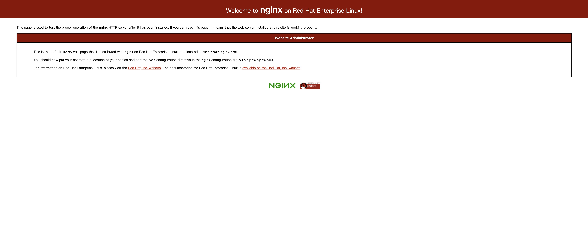
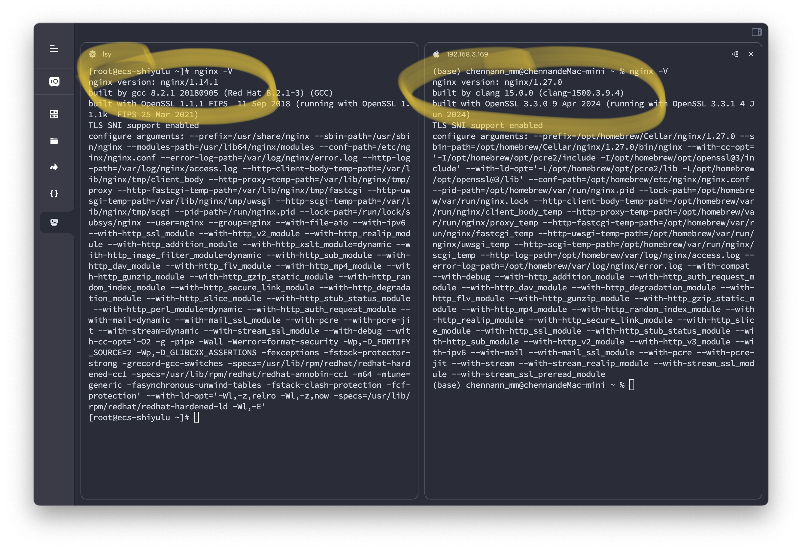
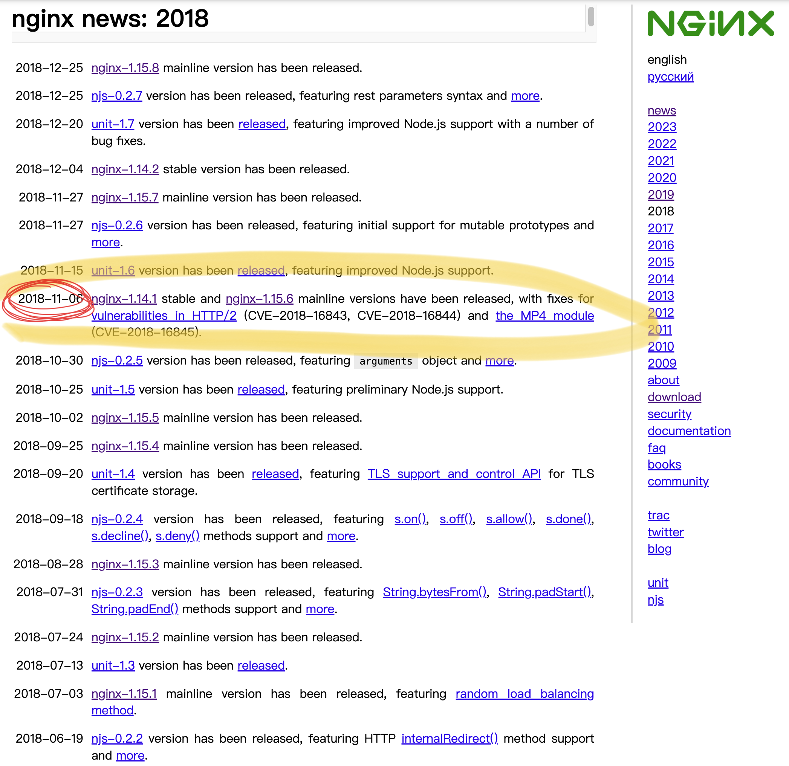
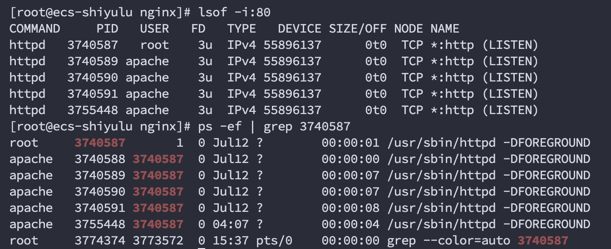

```json
{
  "date": "2024.07.13 16:26",
  "tags": ["nginx"],
  "description":"nginx基础基础最基础的用法"
}
```
# nginx基础配置

## 安装

```bash
brew install nginx
```

## 配置一个目录浏览页面

nginx会从`/opt/homebrew/etc/nginx/servers/`这个路径下读取配置的`server`，所以只需要在这个目录下心间一个文件`default.conf`并且写配置即可。

```
server {
    listen 9090 default_server;
    server_name  _;

    location /download {
        alias /Volumes/disk1/download/;
        # index index.html index.htm;
        autoindex on;  # 启用目录浏览
        autoindex_exact_size off;  # 可选，禁用精确文件大小显示
        autoindex_localtime on;  # 可选，使用本地时间显示文件修改时间

        charset utf-8;  # 指定字符编码为 UTF-8
    }

    location / {
        root   html;
        index  index.html index.htm;
    }
    error_page   500 502 503 504  /50x.html;
    location = /50x.html {
        root   html;
    }
}
```

- 监听`9090`端口
- 默认路径`/`下会展示`index.html`
- `/download`页面下会展示目录浏览页面，实现选择下载功能⏬


## 配置一个前端项目

### 背景

背景是陆老师🧑🏻‍🏫写好了一个web前端项目，需要部署到服务器上给甲方玩一下，服务器上运行的操作系统是`CentOS`，和我之前熟悉的`Ubuntu`和`MacOS`有些不同，首先安装的指令就不一样，在CentOS下需要用`yum`安装，但是我感觉陆老师🧑🏻‍🏫可能是没有做`yum upgrade`和`yum update`(我也不知道有没有这两个指令，懂意思就完了，凑活看吧😅)，所以安装的是`nginx 1.14.1`的远古版本🛖。不管这么多，安装完了就先开始配置吧。

其实配置起来和以前的操作（不管是不同操作系统还是不同nginx版本）都是差不多的。

```bash
[root@ecs-shiyulu nginx]# pwd
/etc/nginx
[root@ecs-shiyulu nginx]# cat nginx.conf
user nginx;
worker_processes auto;
error_log /var/log/nginx/error.log;
pid /run/nginx.pid;

# Load dynamic modules. See /usr/share/doc/nginx/README.dynamic.
include /usr/share/nginx/modules/*.conf;

events {
    worker_connections 1024;
}

http {
    log_format  main  '$remote_addr - $remote_user [$time_local] "$request" '
                      '$status $body_bytes_sent "$http_referer" '
                      '"$http_user_agent" "$http_x_forwarded_for"';

    access_log  /var/log/nginx/access.log  main;

    sendfile            on;
    tcp_nopush          on;
    tcp_nodelay         on;
    keepalive_timeout   65;
    types_hash_max_size 2048;

    include             /etc/nginx/mime.types;
    default_type        application/octet-stream;

    # Load modular configuration files from the /etc/nginx/conf.d directory.
    # See http://nginx.org/en/docs/ngx_core_module.html#include
    # for more information.
    include /etc/nginx/conf.d/*.conf;

    server {
        listen       9000 default_server;
        listen       [::]:9000 default_server;
        server_name  localhost;
        #root         /usr/share/nginx/html;
        root /var/www/html/dist;

        # Load configuration files for the default server block.
        include /etc/nginx/default.d/*.conf;

        location / {
            #alias /var/www/html/dist/;
            try_files $uri $uri/ /index.html;
        }

        error_page 404 /404.html;
            location = /40x.html {
        }

        error_page 500 502 503 504 /50x.html;
            location = /50x.html {
        }
    }
}
```

- 不管合不合理，直接去改`/etc/nginx/nginx.conf`配置文件🤓
- 设置默认server监听`9000`端口，ipv4和ipv6都是
- 不知道是我记错了还是操作系统或者nginx版本的区别，这里的默认root配置是`/usr/share/nginx/html`，但是我之前在Ubuntu上配置nginx的时候记得root是在`/var/www/html/`下的，还是按照熟悉的来吧，能访问的了再说，以后的事以后再说
- 这里学到的新知识是知道了不能用`alias`去修改根目录，是会出问题的，好像说是alias会用类似字符串拼接的方式去找路径，那么陆老师🧑🏻‍🏫在项目里配置的路由当被我刷新页面之后就没用了，所以还是需要通过设置正确的root
- 好了，现在就可以通过`<ip>:9000`的方式访问陆老师🧑🏻‍🏫的前端项目了。


### 项目部署后记

- 陆老师🧑🏻‍🏫和软件版本的爱恨情仇

  陆诗雨同学在我印象中一直是追求最新最前沿的技术以及软件版本，jdk一定要最新的，至少是jdk21以上（写到这想起来我要赶紧升级我自己的jdk版本😵‍💫😵‍💫😵‍💫，拖了好久），然而当我打开陆老师🧑🏻‍🏫装好的nginx默认欢迎页面的时候，我懵了，这个页面作为nginx的默认欢迎页面，我应该熟悉，但是我却从来没见过。

  

  

  配置完项目之后我🤏小小研究了一下这到底是个什么版本，请看对比png⬇️

  

  

  左边是陆老师🧑🏻‍🏫装的版本，右边是我装的版本，`1.14.1` 🆚 `1.27.0`，我在想究竟是什么原因，让陆老师🧑🏻‍🏫放弃最新的版本转而选择这个🛖版本？？？？后来我通过调查nginx官网的更新记录📝，或许找到了其中的些许原因🙋🙋。

  

  官网显示，`nginx-1.14.1`这个版本发布时间是`2018年11月6日`，同期发布的版本也有`nginx-1.15.x`。2018年，那个时候，我们刚上高一，我想，或许陆老师🧑🏻‍🏫想通过这种方式回忆一下他的青春吧🏫，可能那又是一段精彩的故事📖。

  但是我又在想，为什么陆老师🧑🏻‍🏫不选择同期的`nginx-1.15.x`而是坚定的选择`nginx-1.14.1`，经过10分钟的思考和会议，我一下子顿悟了💡。陆老师🧑🏻‍🏫出生于`2003-04-14`，这或许就是他选择`1.14`这个版本的终极原因吧！破案🥳🚀🚀


- 神奇的华为云服务器

  在云服务器上配置`nginx`，我原本设想的是直接监听`http`协议的默认`80`端口，这样的话直接用ip就可以访问前端页面，但是当我拿到陆老师🧑🏻‍🏫的服务器，我发现配置文件⚙️已经被改过了，改成监听`9000`端口了。我想这里应该是陆老师🧑🏻‍🏫启动nginx服务的时候显示`80`端口占用了（因为我后来想改回`80`端口的时候发现占用了），所以改成了`9000`端口。

  那我就好奇了，这个`80`端口到底是什么东西在占用，然后通过查看端口和进程，发现是`apache httpd`占用着`80`端口，我也不懂着`httpd`是什么东西，gpt的回答我总结一下就是一个`http服务器`，我理解下来和`nginx`差不多吧，可能侧重的功能有些不一样。

  

  只是我之前用阿里云服务器的时候没有预装这个`httpd`，所以这里觉得有点奇怪😳🙉。