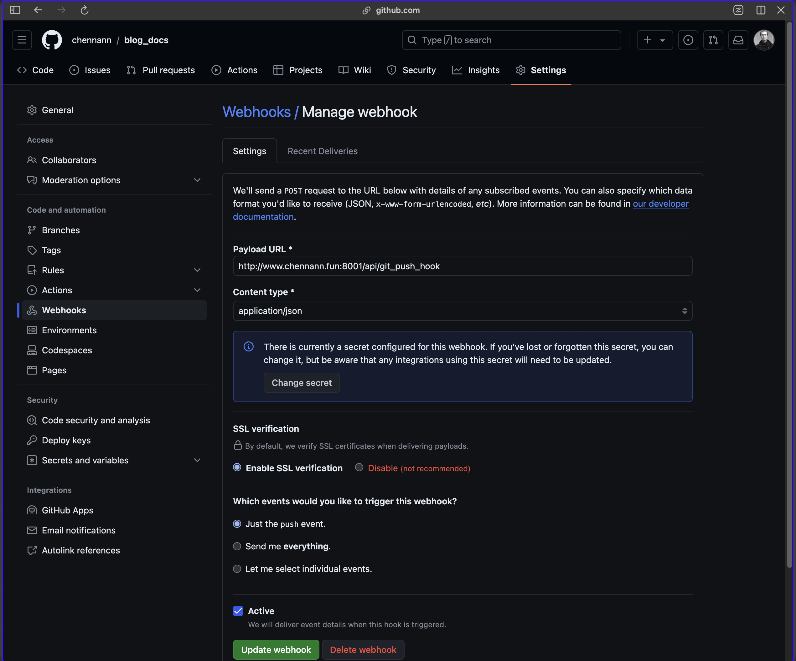

```json
{
  "date": "2024.07.03 23:05",
  "tags": ["git"],
  "description":"在本站点的搭建中用到了一个开源的golang项目，文章内容是保存在另外一个自己的仓库下的，需要实现的功能是这个内容仓库每次提交到github上，会通知golang项目重新拉取最新内容，做到实时更新站点内容。可以借助github的webhook功能实现"
}
```

# webhook的基础用法

- 使用起来其实非常简单，按照这张图上的内容按要求填写就好

  


- 难点是在golang程序的编写，这部分之后再写，因为还不会`go`，一点都不会🫨

