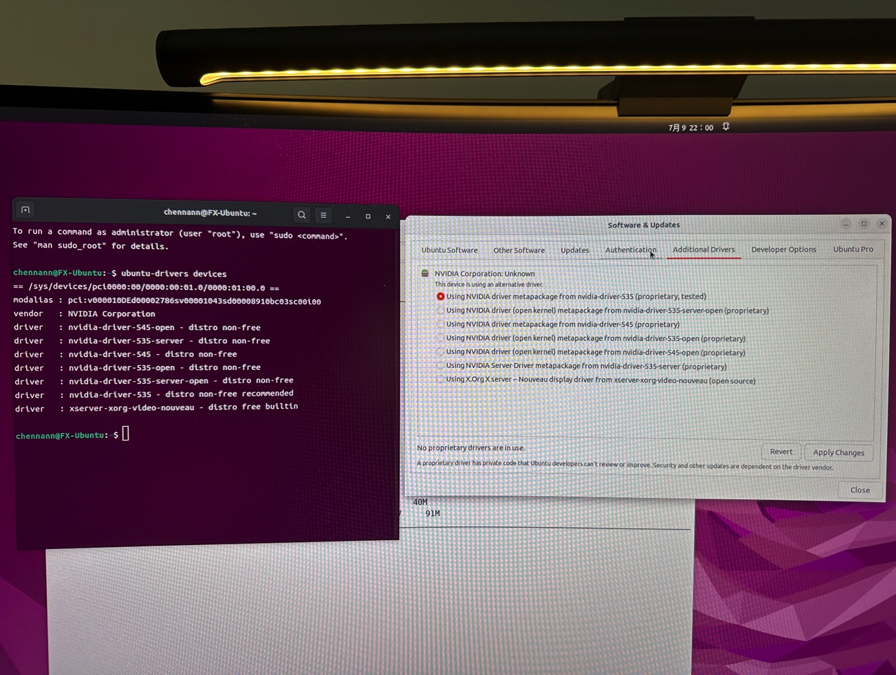

```json
{
  "date": "2024.07.14 00:21",
  "tags": ["Linux"],
  "description":"这次重装系统主要有两个原因🙋。第一个是上次分的130GB的空间实在太小了，而且还是在硬盘最末尾的分区，扩充都扩充不了，下载了几个模型，新建了几个conda环境很快就满了（我也没想到这么不顶用🤦‍♂️）。第二个是前两天发现在M2的macMini上跑文生图的模型好慢好慢，根本用不了🙅🏼‍♂️，然后相拥这台电脑试试，发现显卡驱动好像烂了🤯。所以刚好趁着暑假刚开始把系统重新装一下，之后还能学下机器学习🥹🥹👊。本来打算分一半的硬盘空间，结果最后还是没狠下心，还是只给了350G，哎，就怕windows到时候想装游戏🎮又不够用了🤫🤫，才发现1t的硬盘其实还是不够的，早知道买2t的了🫤。"
}
```
# 安装Windows&Ubuntu双系统

## 背景

这次重装系统主要有两个原因🙋。第一个是上次分的130GB的空间实在太小了，而且还是在硬盘最末尾的分区，扩充都扩充不了，下载了几个模型，新建了几个conda环境很快就满了（我也没想到这么不顶用🤦‍♂️）。第二个是前两天发现在M2的macMini上跑文生图的模型好慢好慢，根本用不了🙅🏼‍♂️，然后相拥这台电脑试试，发现显卡驱动好像烂了🤯。所以刚好趁着暑假刚开始把系统重新装一下，之后还能学下机器学习🥹🥹👊。本来打算分一半的硬盘空间，结果最后还是没狠下心，还是只给了350G，哎，就怕windows到时候想装游戏🎮又不够用了🤫🤫，才发现1t的硬盘其实还是不够的，早知道买2t的了🫤。


## 操作步骤

### 1） 准备硬盘空间

因为这次的系统是要用来替换之前的`Ubuntu`，所以需要先把之前的系统删除掉🗑️，然后把新的系统放进去📥

- 把之前的`130GB`分区做`“删除卷”`

- 把`D盘`（现在的最后一个有效分区）做`“扩展卷”`，变成一个最大的分区，里面包含了很多空白的磁盘空间，可以用来划分新的分区

- 对`D盘`做`“压缩卷”`操作，这里压缩空间量就是要划分出来的空白分区的大小。这里输入$350*1024=358400$

- 最终成功分出来`350GB`的空白分区，之后用来安装新的`Ubuntu`

  

*操作过程截图👇🏻👇🏻👇🏻*


### 2） 从启动盘启动系统

当然有更高级更专业的方法去从系统启动盘启动系统，但是用`windows`的`恢复选项`↩️显然是最方便最傻瓜🤪的方式，比价适合我🙋。

- 用各种方法进入`恢复选项`↩️，当然最简单的是在win菜单直接搜索🔍
- 选择`“高级选项”`的`“立即重新启动”`
- 然后选择`“从CD/U盘启动”`，好像是这个名字🤓
- 选择`“UEFI:CD/DVD Drive”`。这里我第一次激动的选择了`ubuntu`那个选项，后来发现可能是主板中还残留着之前系统的引导🤨？不是很懂，反正不选他。


### 3） 安装Ubuntu

安装过程其实只要跟着引导一步一步走就可以了，唯一需要注意的点记录一下

- 在选择安装位置的时候找到刚才分出来的350GB空白分区，但是这里不会显示350GB，也不会显示358400MB，好像说是单位换算的问题，我也不知道怎么算的🫤，但是无伤大雅🤫🤫
- 点击左下角的加号➕，全部默认选项，最后一行挂在位置选择根目录`“/”`就行，然后`OK`一下
- 选择刚才新增的分区，`Install Now`🔧
- 然后你就等吧。。。。。。。。。。。。🥱。。。。。🥱。。。直到进度条走完安装成功🚀🚀🥳


### 4） 安装合适的显卡驱动

装完系统之后默认是装了一个开源的显卡驱动（好像是这么说的），据说是会有问题的❌，具体什么问题我也不知道🤷，我只知道`nvidia-smi`看不到显卡信息。所以需要重新安装合适的驱动。

- `ubuntu-drivers devices`先看看推荐什么版本，这里他叫我装`535`的版本
- 然后打开`Ubuntu`的`软件与更新`，安装对应的版本就好了
- `nvidia-smi`能看到显卡信息就说明无敌了🚀🚀🚀




### 5）安装conda

下载[Anaconda安装包](http://www.chennann.fun:9090/download)，然后安装就好了

- 最后这里输入`yes`之后会自动配置`.bashrc`
- 也别`source`指令了，重开一个终端就完了🚀🚀🚀


