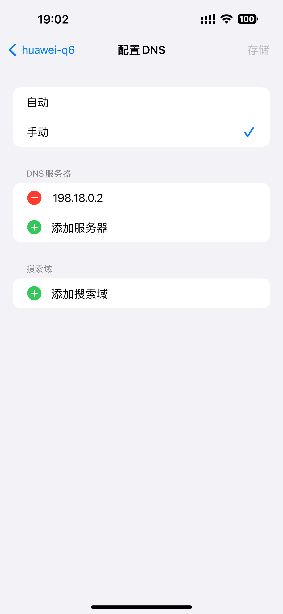

```json
{
  "date": "2024.07.26 19:27",
  "tags": ["macOS", "surge"],
  "description":"之前想要在Mac mini上配置privoxy作为局域网代理服务器，但是搞来搞去最后还是没有搞成原本想象中可用的样子，不是很爽🙉。想起来之前在配置privoxy过程中查资料的时候看到mac➕Surge的组合，发现这或许是一个可行的方案。最终的配置结果是想要接入服务器的设备手动设置一次ip和dns，然后就可以走服务器的代理，实现无感梯子🪜"
}
```

# surge基础使用——配置局域网代理服务器

## 背景

之前想要在Mac mini上配置privoxy作为局域网代理服务器，但是搞来搞去最后还是没有搞成原本想象中可用的样子，不是很爽🙉。想起来之前在配置privoxy过程中查资料的时候看到mac➕Surge的组合，发现这或许是一个可行的方案。


## 准备工作

### 需求🙋

这次的理想目标是局域网中的设备在不主动挂梯子🪜的条件下可用正常访问`google`，`github`，`chatgpt`等外网网站。也就是说要在客厅的Mac mini上部署一个统一的代理服务器，管理所以需要接入外网的设备。然而最终操作部署我选择了一种对当前网络入侵比较小的方式，所以想要访问外网还是要在🛜wifi配置里面手动配置一下`网关`和`dns`，但是这个手动设置只需要一次，所以最后的效果还是让我感觉满意的。

除此之外我还需要代理服务器可以尽可能的选择高质量的节点。

还有一个小小的需求是针对chatgpt💬的，因为我用的机场提供的香港节点🇭🇰是不能访问chatgpt💬的（说是香港ip本来就不可以吗？🧐）。所以我需要这个代理服务器可以去自动分流去往`openai`的流量到`非香港节点`。


### 工具🔧

- 一台可以正常上网的mac

  我手头的是一台m2芯片的最低配`Mac mini`，通过网线连接到家里的路由器。如果要用surge接管路由器，也就是用surge做dhcp服务器的话，软件会推荐用网线连接。但是这次我只是把它作为一个可以被连接的代理服务器🫤🫤

- Surge软件

  我目前使用的是从brew安装的正版surge（因为7天试用还没结束🤫）。我看到网上有很多魔改的破解版，我也下到了一个据说比较稳定的版本，可能等试用到期之后改用那个。不是不愿意支持正版，主要是我就用一部分的功能，更主要的是太贵了💰🤑❌。

- 基础的网络知识和满腔热情🔥

  其实如果当时认认真真学了`计算机网络`这门课，应该就不需要花2天的时间配置Surge了，或者说在玩其他的服务的时候也会愉快很多🤦‍♂️。


## 操作步骤

### ⏬安装Surge

- 直接通过brew安装

```bash
brew install surge
```

💰然后购买激活码💰


- 下载破解版本

  [`Surge 5.4.3 [MacKed] SIP ON Fix.dmg`](http://www.chennann.fun:9090/download/software_MacOS/)


安装完打开是这样的👇🏻👇🏻👇🏻，当然新的软件是没有代理节点的，这里是在配置完之后截的图


### ⚙️导入及调整配置文件

- 从机场导入配置


在`更多->配置`中选择`从URL安装配置...`，然后把机场的订阅链接粘贴过来，Surge会自动下来对应的配置文件，这里的subscribe配置文件就是自动导入的。从url自动导入的配置文件被叫做`托管配置`，是不能被修改的，所以这里需要复制出来一份副本来做进一步的修改。这里的geek就是复制出来的副本。


- 增加规则和策略

  关于`规则`和`策略`，在最后的`后记`部分再详细展开🙋。经过测试，geekspeed默认给的配置里面没有对于chatgpt的特殊策略和规则，这就导致了有时候自动选择到了香港节点导致了访问不了chatgpt。还有一个是默认配置中的`Proxy`策略组没有`DIRECT`选项，这让我不太舒服，总感觉自己的流量不够用（但是其实理论上不看youtube的话应该也够🫤）。针对这些问题，我增加和修改了一些配置👇🏻👇🏻

  ```bash
  #新增规则
  DOMAIN-KEYWORD,chatgpt,💬ChatGPT
  DOMAIN-KEYWORD,openai,💬ChatGPT
  
  #修改策略组
  Proxy = select, DIRECT, auto, auto-low, fallback, 🇸🇬 新加坡｜CU 1X ChatGPT ...
  💬ChatGPT = url-test, 🇸🇬 新加坡｜CU 1X ChatGPT, 🇸🇬 新加坡｜CN2 1X ChatGPT, 🇸🇬 新加坡｜CU 1X AWS 全解鎖 ...(无🇭🇰香港节点)
  ```

  

- 设置系统代理和增强模式
  
  想要实现我需要的功能，surge必须开启`增强模式`，这个`增强模式`具体是什么，我也不知道🤷，无所谓，能用就行🫤🤫。把这两个开关打开。
  
  
  


修改完成之后选择应用这个配置文件，然后就可以在软件中看到配置文件中的节点，策略和规则了👇🏻👇🏻👇🏻


在状态栏中同样可以看到👇🏻👇🏻👇🏻


### 📱客户机手动设置

打开增强模式之后，可以看到Mac mini的dns也发生了变化👇🏻👇🏻


这个时候到想要接入服务器的设备上设置`手动ip`和`手动dns`👇🏻👇🏻




这里是手机上的设置，电脑上也是一摸一样的。需要注意的是这里的ip最好还是延用之前路由器分发的地址，不然怕冲突上不了网💥。


### 🚀测试成功访问

经过测试，经过这些配置，接入代理服务器的设备现在已经可以访问`google`和其他网站。成功！🚀🚀🚀


## 后记

关于配置文件中的策略和规则，这是这次学到的新东西，大致概括一下就是策略组定义了一个节点列表，可以手动选择，也可以让软件自动选择，一个策略组在同一时间只能有一个目标节点；规则定义了去往指定目的地的流量要通过哪个策略组发出。这样就可以实现往google的流量通过香港节点走，而通往chatgpt的流量通过新加坡节点走，实现分流，保证了大部分连接高速稳定的同时保证了chatgpt可以正常访问。

在配置过程中遇到的一个最大的坑是在手机📱上配置的时候没有修改手动dns，导致设备没办法走服务器的代理，其中具体的原理还不是很清楚，唯一清楚的是应该好好上课🙉😅